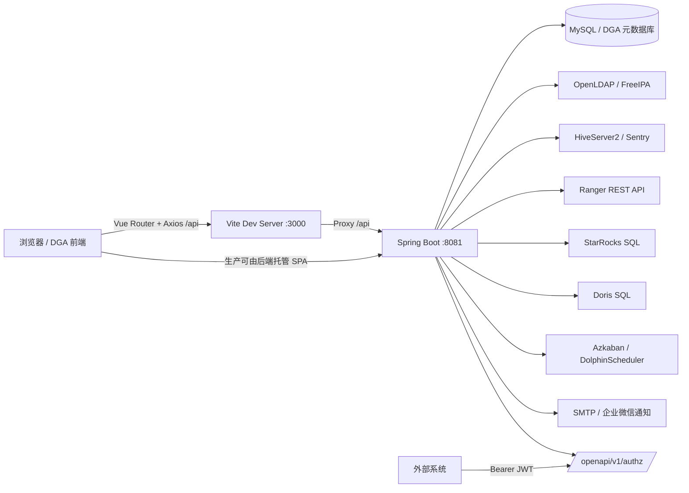

# DGA 当前架构设计与迭代优化方案

生成日期：2026-06-09  
适用范围：当前工作区 `/Users/dingquan/it/idea/bf_bigdata_manage` 的代码实现、运行脚本和现有文档。本文描述的是当前代码状态，不替代早期愿景文档 `DGA_Design_Document.md`。

## 1. 结论摘要

DGA 当前已经从“数据治理平台原型”演进为一个以权限治理为核心、同时覆盖元数据、数据地图、质量、调度上下文、资源导航和系统设置的单体 Web 平台。

现有技术形态：

- 前端：Vue 2.7 + Vite + Ant Design Vue，局部引入 Element UI、ECharts。
- 后端：Spring Boot 2.7.18 + Java 8 + Spring Security JWT + Spring Data JPA + JDBC/LDAP/Mail。
- 存储：MySQL 8 方言为主，测试配置支持 H2；数据库初始化主要依赖 `schema.sql` 和手工升级脚本。
- 运行：本地脚本启动前端 `3000`、后端 `8081`，Vite `/api` 代理到后端 `8081`。
- 外部系统：OpenLDAP/FreeIPA、HiveServer2/Sentry、Ranger、StarRocks、Doris、Azkaban/DolphinScheduler、SMTP/企业微信通知。

当前最强的模块是权限中心：已经具备多授权后端适配、RBAC 角色台账、历史权限接管、实时与本地权限对账、风险治理、AI Agent 建议、离职权限回收、OpenAPI 直接授权等能力。主要短板是边界膨胀、数据库迁移治理不足、敏感配置外置不彻底、自动化测试覆盖偏集中、前端大页面和 UI 技术栈混用。

## 2. 系统运行架构



运行入口：

- `./run-local.sh`：构建后端、准备前端依赖，并启动后端 `8081`、前端 `3000`。
- `./stop-local.sh`：停止本地前后端服务。
- `dga-frontend/vite.config.js`：开发态 `/api` 代理到 `http://localhost:8081`。
- `dga-backend/src/main/resources/application.properties`：默认激活 `test` profile，并定义 JWT、邮件、LDAP POSIX、元数据采集和离职回收扫描配置。

注意：根目录 `README.md` 仍有后端 `8080` 的说明，但当前脚本和 OpenAPI 文档使用 `8081`，需要统一。

## 3. 后端逻辑架构

后端保持典型 Spring 分层结构：`controller -> service -> repository/entity`，包名按业务域划分。

| 业务域 | 主要入口 | 核心服务/对象 | 当前职责 |
|---|---|---|---|
| 平台认证 | `AuthController`、`SecurityConfig` | `JwtService`、`JwtAuthenticationFilter`、`User` | 登录、注册、JWT 鉴权、平台用户和管理员能力 |
| 集群与端点 | `ClusterController` | `ClusterService`、`HiveServer2ConnectionService`、`Cluster`、`ClusterEndpoint` | 集群、授权端点、Hive JDBC 驱动选项和连通性测试 |
| 用户与 LDAP | `AccessController` | `LdapService`、`DgaUserSchemaService`、`DgaUser`、`LdapGroupEmptyState` | DGA 用户、LDAP 用户/组、主组/附加组、密码/锁定、用户修复 |
| 授权中心 | `AccessController` | `AuthorizationService`、`AuthRoleService`、各 `AuthorizationProvider` | 资源发现、权限查询、角色目录、角色权限、角色绑定、授权/回收 |
| 授权后端适配 | `AuthorizationService` | `CdhSentryAuthorizationProvider`、`RangerAuthorizationProvider`、`StarRocksSqlAuthorizationProvider`、`DorisSqlAuthorizationProvider` | 隔离 Sentry/Ranger/StarRocks/Doris 的资源、用户、权限和角色差异 |
| 历史权限接管 | `AccessController` | `HistoricalPermissionAdoptionService` | 将历史权限按角色范围写入 DGA 本地记录，保留来源与差异 |
| 离职权限回收 | `OffboardingRevocationController` | `OffboardingRevocationService`、`OffboardingRevocationScheduler` | 预检、创建回收任务、任务台账、定时扫描执行、确认归档 |
| 权限风险治理 | `AccessGovernanceController` | `AccessGovernanceService` | 风险扫描、证据采集、责任人、认领/复核/解决 |
| AI 治理 Agent | `AccessGovernanceAgentController` | `AccessGovernanceAgentService`、`DeepSeekClient` | 风险解释、治理计划、报告生成、受控动作审计 |
| 开放授权接口 | `OpenAuthzController` | `AuthorizationService`、本地权限台账 | 对外查询集群/用户/资源/权限，直接授权和直接回收 |
| 数据源 | `DataSourceController` | `DataSourceSyncService`、`DataSourceConfig` | 数据源配置、连接测试、触发元数据采集 |
| 元数据中心 | `MetadataController` | `MetadataCollectionService`、`MetadataCollectorFactory`、`HiveMetadataCollector`、`StarRocksMetadataCollector` | 表/字段/分区/业务元数据、主题/标签/指标、采集任务 |
| 数据地图 | `DataMapController` | `UserRecentViewRepository`、元数据仓库 | 统计、最近访问、资产入口 |
| 血缘 | `LineageController` | `LineageCollectionService`、`LineageSqlParser`、调度采集器 | 调度来源采集、SQL 解析、表级血缘图 |
| 数据质量 | `QualityController` | `QualityExecutionService` | 质量规则、执行记录、质量问题 |
| 调度上下文 | `SchedulerTaskController` | `SchedulerTaskService` | 调度任务、责任人、风险任务、分组 |
| 资源导航 | `ResourceLinkController` | `ResourceLinkRepository` | 常用资源链接、favicon、快捷添加 |
| 设置与通知 | `SettingsController` | `SettingsService`、`NotificationService` | 系统/个人设置、企业微信和邮件测试 |

### 3.1 授权后端抽象

`AuthorizationProvider` 是权限中心的核心扩展点，定义了：

- 能力识别：`supports`、`engineType`、`authBackend`、`descriptor`。
- 资源发现：库、表、用户、组、后端角色。
- 权限读取：`getUserPermissions`。
- 身份和授权写入：创建用户、授权、回收、全量回收。
- 原生角色能力：创建角色、角色权限、角色绑定和解绑。

`AuthorizationService` 根据集群和 `authBackend` 组装 `AuthorizationContext`，选择具体 Provider。这个设计已经把 Sentry/Ranger/StarRocks/Doris 的差异封装在后端，前端只需要基于 capability 控制页面行为。

### 3.2 当前权限治理原则

当前代码和既有台账已经形成几个重要治理约束：

- RBAC 角色表示“可授权权限范围”，绑定角色不等于自动全量授权。
- 实际授权必须通过子集授权、历史接管、直接授权或开放接口等明确动作落地。
- 历史权限接管默认非破坏性，优先写 DGA 本地记录。
- Sentry 可保留 `USER`、`USER_ROLE`、`GROUP_ROLE`、`sourceRole`、`sourceGroup` 等来源；StarRocks/Doris 的 `SHOW GRANTS` 结果更扁平，不具备等价来源元数据，因此历史反向绑定不应简单放开。
- 角色外的历史权限应被标记为治理差异，不能因为单个用户的额外权限就自动扩大共享角色。
- AI Agent 只做分析、建议、计划和报告，高风险写操作必须由管理员确认。

## 4. 前端逻辑架构

前端以 `MainLayout.vue` 作为登录后的统一框架，`router/index.js` 管理主要业务页面。

| 路由 | 页面 | 职责 |
|---|---|---|
| `/login` | `Login.vue` | 登录和 token 入口 |
| `/datamap` | `DataMap.vue` | 数据地图首页 |
| `/datasource` | `DataSourceManagement.vue` | 数据源管理 |
| `/access` | `AccessIndex.vue` | 用户管理 |
| `/authorization-center` | `AuthorizationCenter.vue` | 授权工作台 |
| `/role-management` | `AuthorizationCenter.vue` | 角色管理模式 |
| `/access-governance` | `AccessGovernancePanel.vue` | 权限风险治理 |
| `/offboarding-revocation` | `OffboardingRevocation.vue` | 离职权限回收 |
| `/metadata`、`/metadata/detail/:id` | `Metadata.vue`、`MetadataDetail.vue` | 元数据列表和详情 |
| `/quality` | `Quality.vue` | 数据质量中心 |
| `/scheduler-tasks` | `SchedulerTasks.vue` | 调度任务管理 |
| `/resources` | `ResourceManagement.vue` | 资源导航 |
| `/environment-resources`、`/cluster-management` | `ClusterManagement.vue` | 环境资源和集群管理 |
| `/platform-users` | `PlatformUsers.vue` | 平台用户 |
| `/settings` | `SettingsCenter.vue` | 设置中心 |
| `/profile` | `UserProfile.vue` | 个人中心 |

当前前端的权限中心组件化已经有基础：`UserList`、`GrantModal`、`PermissionPanel`、`RoleCatalogPanel`、`RoleGrantWorkbench`、`HistoricalPermissionAdoptionModal`、`PermissionVerificationPanel`、`StarRocksInventoryModal`、`AccessGovernancePanel`、`LdapGroupManager` 等。但 `AuthorizationCenter.vue` 仍超过 2000 行，`OffboardingRevocation.vue` 也已经进入工作台复杂度，后续需要继续拆成“页面编排 + 业务状态 + 展示组件”。

## 5. 数据模型现状

当前 `schema.sql` 已覆盖以下核心表族：

| 表族 | 代表表 | 说明 |
|---|---|---|
| 数据源 | `data_source_config` | 数据源类型、连接信息和采集配置 |
| 技术元数据 | `meta_table_info`、`meta_column_info`、`meta_partition_info` | 表、字段、分区 |
| 业务元数据 | `dga_data_theme`、`dga_table_business_metadata`、`dga_metadata_tag`、`dga_table_tag_mapping`、`dga_metric_definition` | 主题、标签、指标、业务说明 |
| 元数据采集 | `dga_metadata_collection_task`、`dga_metadata_context_suggestion` | 采集任务和上下文建议 |
| 数据质量 | `dga_quality_rule`、`dga_quality_execution`、`dga_quality_issue` | 规则、执行、问题 |
| 平台用户 | `users` | DGA 登录用户 |
| 大数据用户 | `dga_users` | 受管集群用户 |
| 集群端点 | `dga_cluster`、`dga_cluster_endpoint` | 集群和授权/数据/调度端点 |
| 权限台账 | `user_resource_access`、`dga_access_log` | 本地授权记录和访问日志 |
| RBAC | `auth_role`、`auth_role_permission`、`auth_user_role`、`auth_role_assignment_audit` | 角色、角色权限、绑定、审计 |
| LDAP 状态 | `ldap_group_empty_state` | 空组状态快照 |
| 风险治理 | `access_governance_issue`、`access_activity_evidence`、`access_owner` | 风险、证据、责任人 |
| 离职回收 | `dga_offboarding_revocation_task` | 离职回收任务 |
| 设置 | `dga_system_setting` | 系统和个人设置 |
| 调度上下文 | `dga_scheduler_task_owner`、`dga_scheduler_task_context` | 调度责任人和 SQL 上下文 |

需要注意：

- 代码里存在 `access_governance_ai_advice`、`access_governance_ai_plan`、`access_governance_ai_action_audit` 对应实体和仓库，但当前 `schema.sql` 未看到对应建表语句。若依赖 JPA 自动建表可能造成环境漂移，建议纳入正式迁移。
- 迁移目前分散在 `schema.sql`、`docs/sql/*.sql` 和 `docs/database-change-log.md`，缺少 Flyway/Liquibase 这类版本化迁移基线。

## 6. 关键业务流程

### 6.1 登录与鉴权

1. 前端登录页调用 `/api/auth/login`。
2. 后端校验 `users` 表密码或 OAuth2 回调，生成 JWT。
3. 前端缓存 token 和用户信息，路由守卫拦截非登录页。
4. 后端 `JwtAuthenticationFilter` 对 `/api/**` 鉴权，`/api/auth/login`、Swagger、OAuth2、健康检查等放行。

### 6.2 集群和授权端点注册

1. 管理员在集群管理页维护 `dga_cluster`。
2. 为集群配置 HiveServer2、LDAP、Ranger、StarRocks、Doris、调度源等 `dga_cluster_endpoint`。
3. 授权中心通过 capability 接口识别当前集群可用的身份来源、主体类型、资源类型和授权动作。

### 6.3 授权中心 RBAC

1. 角色目录维护 `auth_role`。
2. 角色权限范围维护 `auth_role_permission`。
3. 用户/组绑定角色写入 `auth_user_role` 和审计表。
4. 角色绑定后的实际授权仍需选择权限子集执行，写入后端授权系统并记录 `user_resource_access`。
5. 权限校验会比较 live 权限和 recorded 权限，展示一致、缺失、额外和本地-only 等状态。

### 6.4 历史权限接管

1. 用户选择角色和历史用户，后端读取 live 权限。
2. 只有具备来源元数据的后端才适合做可靠接管；当前重点是 Sentry。
3. 接管动作将角色范围内的历史权限写为 DGA 本地记录，差异和角色外权限转入治理视角。
4. StarRocks/Doris 若要支持接管，需要新增来源感知的数据模型或新的匹配算法。

### 6.5 离职权限回收

1. 页面先调用预检接口，汇总用户在指定集群的权限和可回收范围。
2. 创建 `dga_offboarding_revocation_task`，记录离职日期、计划执行时间、联系人和原因。
3. 调度器定期扫描到期任务，调用权限回收能力，并生成确认信息和归档标识。
4. 页面展示任务台账和详情，便于安全/直属负责人确认闭环。

### 6.6 元数据采集与数据地图

1. 数据源页面维护 `data_source_config`。
2. `MetadataCollectorFactory` 根据数据源类型选择 Hive 或 StarRocks 采集器。
3. 采集结果写入表、字段、分区和采集任务表。
4. 数据地图和元数据详情页基于统一元数据模型提供搜索、目录树、业务元数据、权限、血缘、质量等入口。

### 6.7 血缘与调度上下文

1. 调度采集器从 Azkaban/DolphinScheduler 等来源读取任务上下文。
2. `LineageSqlParser` 目前通过正则识别 `insert/from/join` 里的 `db.table`。
3. 解析结果写入调度上下文和表级血缘，供元数据详情和血缘图查询。

### 6.8 数据质量

1. 用户维护质量规则。
2. 后端按表或规则触发质量执行。
3. 执行结果写入 `dga_quality_execution`，异常写入 `dga_quality_issue`。
4. 页面展示质量概览、规则、执行和问题。

### 6.9 开放授权 API

1. 外部系统先通过 `/api/auth/login` 获取 JWT。
2. 使用 `/openapi/v1/authz` 查询集群、用户、资源和权限。
3. `/openapi/v1/authz/grants` 与 `/openapi/v1/authz/revokes` 属于直接用户授权/回收，会调用后端授权系统并写本地台账。
4. 该路径不走前端 RBAC 角色绑定流程，因此要加强幂等、审计和调用方限流。

## 7. 当前优势

- Provider 抽象已经成型，多授权后端可以在同一页面和同一服务层下工作。
- RBAC 台账、真实后端权限和历史权限接管三者已经有清晰分工。
- 权限风险治理开始形成“扫描 -> 证据 -> 责任人 -> 状态流转”的闭环。
- 离职回收从单次按钮操作升级为任务台账，适合安全审计。
- 元数据、血缘、质量、调度上下文已经接到同一个平台，不再是孤立页面。
- OpenAPI 已经把权限能力开放给外部系统，有利于后续接审批/工单。

## 8. 当前风险和架构债

| 风险 | 现象 | 影响 | 建议方向 |
|---|---|---|---|
| 授权控制器过大 | `AccessController` 已超过 3500 行 | 新需求容易继续堆叠，测试和回归困难 | 拆成用户、LDAP、角色、资源、授权执行、审计几个控制器 |
| 前端页面过大 | `AuthorizationCenter.vue` 超过 2000 行，离职回收页也进入复杂工作台形态 | 状态耦合、构建体积和交互回归压力增加 | 页面编排、API service、状态 helper、业务组件继续分层 |
| 数据库迁移不可追踪 | `schema.sql`、升级 SQL、实体之间可能漂移 | 测试/生产升级容易漏表漏字段 | 引入 Flyway/Liquibase，建立 V1 baseline |
| AI 治理表缺口 | AI 实体存在，但 `schema.sql` 未见对应建表 | 不同环境启动行为不一致 | 补正式迁移并补初始化校验 |
| 敏感配置治理不足 | 默认配置和文档中存在账号、密码、环境地址等信息 | 泄漏风险、部署不规范 | 敏感项全部 env/secret 外置，文档只保留变量名 |
| 端口文档不一致 | README 写 8080，脚本/代理使用 8081 | 新人启动和对接误判 | 统一 README、OpenAPI、脚本说明 |
| UI 技术栈混用 | Ant Design Vue 与 Element UI 同时存在 | 包体、样式和交互一致性风险 | 确定主 UI 栈，逐步收敛 |
| SQL 血缘解析偏弱 | 当前主要基于正则匹配 | 复杂 SQL、CTE、临时表、字段级血缘不足 | 引入成熟 SQL parser 或接 Atlas/调度血缘 |
| 外部调用多为同步直连 | 授权、采集、回收等动作直接依赖外部系统响应 | 超时/重试/补偿不充分 | 任务化、重试、幂等键、状态机 |
| 测试覆盖集中在授权 | 现有测试多集中在权限服务和 helper | 元数据、质量、调度、设置缺少保护 | 按核心流程补 service/controller 测试和少量 E2E |

## 9. 迭代优化路线图

### P0：稳定当前交付面，1-2 周

目标：把当前已经可用的能力变得可部署、可回归、可解释。

| 任务 | 具体动作 | 验收标准 |
|---|---|---|
| 运行文档统一 | 修正 README 的后端端口、启动说明、健康检查；补 docs 索引 | 新人按 README 可在本地启动并访问 `3000/8081` |
| 敏感配置外置 | SMTP、JWT、数据库、LDAP、Ranger 等只保留变量名和示例，不保留真实默认密码 | `application*.properties` 无真实密码默认值 |
| 迁移基线 | 引入 Flyway 或 Liquibase；把现有 `schema.sql` 固化为 baseline | 空库可一键迁移；升级库有版本记录 |
| AI 表补齐 | 为 `access_governance_ai_*` 三张表补迁移和索引 | 测试库和生产库检查表结构一致 |
| 控制器拆分第一步 | 从 `AccessController` 中拆出角色/RBAC、LDAP、资源发现三个控制器 | 原接口路径不变，授权中心现有测试通过 |
| 回归脚本 | 固化 `mvn -Dtest=... test`、`npm run test`、`npm run build` 的最小回归集 | 文档中有明确命令，CI 或本地能重复执行 |

### P1：权限中心模块化，2-4 周

目标：降低权限中心的迭代成本，把“平台核心能力”从大控制器和大页面里释放出来。

| 任务 | 具体动作 | 验收标准 |
|---|---|---|
| 后端边界重组 | 拆分为 `UserDirectoryController`、`LdapGroupController`、`AuthRoleController`、`PermissionResourceController`、`PermissionExecutionController`、`PermissionAuditController` | 每个控制器职责单一，单文件低于 800 行 |
| 命令对象标准化 | 授权、回收、历史接管、离职回收统一命令对象和结果对象字段 | 前端不再拼装多个相似 payload |
| Capability 注册表 | 将 Provider 能力、主体类型、权限粒度、是否支持角色/组/接管做成统一描述 | 前端按钮显隐只依赖 capability |
| 前端状态拆分 | `AuthorizationCenter.vue` 拆出 API service、role state、permission state、governance state | 页面编排文件低于 800 行 |
| 离职回收标准任务化 | 回收任务状态、失败原因、重试、确认归档统一模型 | 失败任务可重试，成功任务可审计 |
| 授权对账作业 | 定时或手动触发 live vs recorded 对账，输出差异 | 权限中心可按集群/用户查看差异清单 |

### P2：治理闭环和开放集成，1-2 个月

目标：从“可操作平台”升级为“持续治理平台”。

| 任务 | 具体动作 | 验收标准 |
|---|---|---|
| OpenAPI 幂等 | grants/revokes 增加 requestId/idempotencyKey、调用方标识、审计事件 | 外部系统重复调用不产生重复台账 |
| 工单/审批接入预留 | 定义申请单、审批状态、授权执行任务、回调状态 | DGA 可接 Doveket/工单系统而不改授权核心 |
| 风险治理周期任务 | 将风险扫描、证据刷新、责任人提醒任务化 | 风险项有最近扫描时间和证据新鲜度 |
| 通知中心规范化 | 邮件/企业微信模板、收件人策略、失败重试、发送日志 | 离职回收和风险治理通知可追踪 |
| 元数据采集任务化 | 采集任务统一状态机、重试、部分成功、采集统计 | 采集失败可定位到数据源/库/表 |
| 质量规则增强 | 增加规则模板、执行参数、告警阈值和主题域视图 | 质量中心可承接核心表监控 |

### P3：平台化和智能化，季度级

目标：让 DGA 支撑更多集群、更复杂治理规则和更高可靠性的生产使用。

| 任务 | 具体动作 | 验收标准 |
|---|---|---|
| 工作流引擎 | 将授权申请、离职回收、风险处置抽象为 workflow/task | 所有高风险动作有审批、执行、复核轨迹 |
| 血缘解析升级 | 引入成熟 SQL parser 或接 Atlas/调度系统血缘；支持 CTE、临时表、字段级血缘 | 复杂 SQL 解析准确率可量化 |
| 可观测性 | 增加健康检查、外部系统连接指标、慢调用、任务失败率、审计指标 | 能从指标定位 LDAP/Ranger/Sentry/SR/Doris 故障 |
| 多环境发布 | dev/test/prod 配置分层、密钥托管、数据库迁移、回滚策略 | 生产升级不依赖手工 SQL 拼接 |
| 前端性能治理 | 路由级懒加载、组件库收敛、图表按需加载 | 构建产物和首屏时间可控 |
| 权限智能治理 | AI Agent 接入治理建议质量评估、人工反馈、报告模板 | AI 建议可审计、可回放、可改进 |

## 10. 建议的近期任务拆分

| 优先级 | 任务 | 涉及文件/模块 | 交付物 |
|---|---|---|---|
| P0-1 | 修正启动和端口文档 | `README.md`、`docs/README.md` | 本地启动说明统一到 `8081/3000` |
| P0-2 | 建立迁移基线 | `dga-backend/src/main/resources/schema.sql`、`docs/sql` | Flyway/Liquibase baseline 和升级说明 |
| P0-3 | 补 AI 治理表迁移 | `access_governance_ai_*` 实体和 migration | 三张 AI 表建表 SQL + 索引 |
| P0-4 | 拆 `AccessController` 第一刀 | access controller/service | 原路径兼容、测试通过 |
| P0-5 | 权限最小回归集 | backend tests、frontend tests | README 或 docs 中固化命令 |
| P1-1 | 授权中心前端拆状态 | `AuthorizationCenter.vue` 和 components | API service + state helper + 页面编排 |
| P1-2 | 离职回收重试和通知 | `OffboardingRevocationService`、`NotificationService` | 失败重试、通知日志、任务详情 |
| P1-3 | OpenAPI 幂等和审计 | `OpenAuthzController`、权限台账 | requestId、防重复、调用方审计 |
| P2-1 | 风险治理定时扫描 | `AccessGovernanceService` | 周期任务、扫描批次、证据新鲜度 |
| P2-2 | 血缘 parser 选型验证 | `LineageSqlParser` | SQL parser POC 和准确率对比 |

## 11. 设计护栏

- 不要为了“历史接管方便”直接放开 StarRocks/Doris 的反向绑定；必须先解决来源元数据或算法可信度。
- 不要把某个历史用户的额外权限自动并入共享角色；先标记差异，再看是否形成多人共性。
- 不要让 AI Agent 直接执行高风险授权、回收、删除动作；必须有人审、有人点、可回放。
- 不要让 OpenAPI 绕过 DGA 台账；所有直接授权/回收都必须写审计。
- 不要继续把权限新能力堆进 `AccessController` 和 `AuthorizationCenter.vue`；新增能力先确定边界。
- 不要在配置、SQL、文档中保留真实密码、token、生产账号。

## 12. 推荐验证命令

当前文档变更本身不需要编译，但后续做 P0/P1 代码改造时建议最少跑：

```bash
cd dga-backend
mvn -Dtest=AccessControllerStarRocksInventoryTest,AccessControllerTableSubsetTest,AuthRoleServiceTest,HistoricalPermissionAdoptionServiceTest,OffboardingRevocationServiceTest test
```

```bash
cd dga-frontend
npm run test
npm run build
```

如果只验证本地服务：

```bash
./run-local.sh
curl -fsS http://localhost:8081/api/health
```
